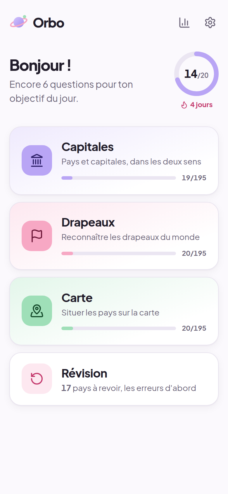
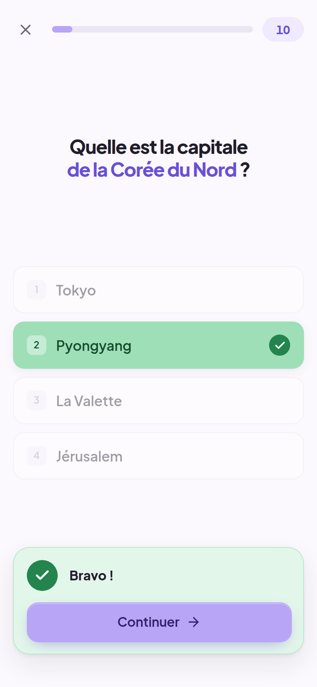
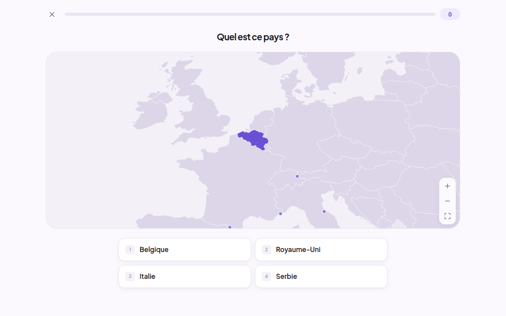
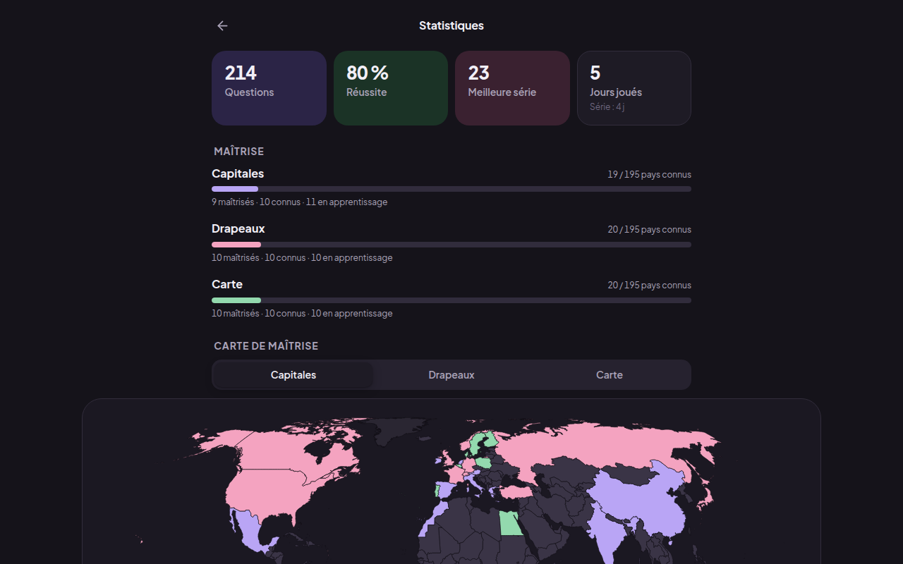

# Orbo

Apprendre la géographie en jouant : **capitales**, **drapeaux** et **carte du monde**.
Des sessions courtes, une progression visible, et les pays que tu rates qui reviennent jusqu'à ce que tu les saches.

<p>
  
  
</p>
<p>
  
  
</p>

- **195 pays** : les 193 États membres de l'ONU + le Vatican et la Palestine (observateurs), tout en français.
- **6 façons de jouer** : pays → capitale, capitale → pays, drapeau → pays, pays → drapeau, situer un pays sur la carte, nommer le pays affiché.
- **QCM puis saisie libre**, automatiquement pays par pays : après 2 bonnes réponses d'affilée, on te demande de taper la réponse.
- **Saisie tolérante** : accents, majuscules, tirets et petites fautes acceptés ; noms alternatifs reconnus (Birmanie / Myanmar, RDC, Kyiv…) ; mais « Niger » n'est pas accepté pour « Nigeria ».
- **Révision** : répétition espacée (1, 2, 4, 9, 21 jours), les erreurs d'abord.
- **Statistiques** : réussite, séries, carte de maîtrise, pays les plus ratés.
- **Hors ligne**, sans compte, sans serveur : tout est enregistré sur l'appareil. Mode clair / sombre, mobile et bureau.

---

## Installer l'appli Windows (.exe)

Le fichier `.exe` est construit automatiquement par GitHub Actions à chaque push :

1. Sur GitHub, onglet **Actions** → workflow **« Tests et build Windows (.exe) »** → dernière exécution réussie.
2. En bas de la page, télécharge l'artefact **Orbo-Windows** (un fichier zip).
3. Dans le zip :
   - `Orbo-Setup-1.0.0.exe` : installateur (raccourcis Bureau et menu Démarrer) ;
   - `Orbo-1.0.0-portable.exe` : version portable, rien à installer, il suffit de double-cliquer.

Windows peut afficher « Windows a protégé votre ordinateur » parce que l'exécutable n'est pas signé :
clique sur **Informations complémentaires → Exécuter quand même**.

Pour publier une version dans l'onglet **Releases**, crée un tag : `git tag v1.0.0 && git push origin v1.0.0`.

### Construire le .exe sur ton PC Windows

Prérequis : [Node.js 22](https://nodejs.org).

```bash
npm install
npm run dist:win      # → release/Orbo-Setup-1.0.0.exe et release/Orbo-1.0.0-portable.exe
```

Pour lancer l'appli de bureau sans l'empaqueter : `npm run electron:dev`.

---

## Développement

```bash
npm install
npm run dev           # http://localhost:5173 (ajoute --host pour l'ouvrir depuis ton téléphone)
npm run build         # site statique dans dist/
npm run preview       # sert dist/ en local
```

| Commande | Rôle |
|---|---|
| `npm test` | Tests unitaires (saisie tolérante, modes de jeu, sélection, répétition espacée) |
| `npm run test:e2e` | Tests de bout en bout dans un vrai navigateur, mobile et bureau (`npx playwright install chromium` la première fois) |
| `npm run check` | Vérification des types (TypeScript + Svelte) |
| `npm run data:fetch` | Retélécharge les sources (Wikidata, mledoze/countries, Natural Earth) |
| `npm run data` | Reconstruit les données puis les valide (`data:build` + `data:validate`) |
| `npm run icons` | Régénère les icônes (PWA et Windows) depuis le logo |
| `npm run dist:win` | Construit l'appli Windows |

---

## Comment tester, étape par étape

### Étape 1 — Données

```bash
npm run data:validate
```

Le script s'arrête en erreur au moindre problème et écrit [`data/REPORT.md`](data/REPORT.md) :
nombre de pays (193 + 2), capitales, drapeaux, formes sur la carte, noms ambigus, tests de saisie, désaccords entre sources, et une liste des 195 formulations « Quelle est la capitale du/de la/des… ? » à relire.
Pour tout reconstruire depuis les sources figées : `npm run data`. Les corrections manuelles sont dans [`data/curation/`](data/curation/README.md).

### Étape 2 — Structure et design system

`npm run dev`, puis ouvre `http://localhost:5173/#/design` : couleurs, typographie, boutons, sélecteurs, réponses (bonne, mauvaise, révélée), saisie, progression. Bascule clair / sombre en haut de la page.
Dans **Réglages** (roue dentée), le thème et la réduction des animations sont mémorisés.

### Étape 3 — Modes de jeu

- **Capitales** : choisis « Pays → capitale », niveau Facile, joue au clavier (touches **1 à 4**, puis **Entrée** pour continuer). Passe en format **Saisie** et tape `ouagadougu` ou `cote divoire` : c'est accepté, avec la bonne orthographe affichée.
- **Drapeaux** : « Pays → drapeau » propose 4 drapeaux (6 en niveau Difficile, avec des drapeaux ressemblants : Tchad / Roumanie, Monaco / Indonésie…).
- **Carte** : « Situer le pays » avec la région Europe ; zoome à la molette, au pincement ou en double-cliquant sur la mer. Les micro-États (Vatican, Monaco, Malte…) ont un marqueur cliquable. Clique à côté : le pays touché devient rose, le bon pays vert, avec la distance en km.

### Étape 4 — Progression

1. Joue une partie et rate quelques pays exprès.
2. Recharge la page (ou ferme et rouvre l'appli) : l'accueil affiche l'objectif du jour, la série de jours et le nombre de pays à revoir.
3. Ouvre **Révision** : les pays ratés sortent en premier.
4. Ouvre **Statistiques** (icône graphique) : carte de maîtrise, pays les plus ratés, bouton « S'entraîner sur ces pays ».
5. Réponds juste deux fois de suite au même pays en mode Auto : la fois suivante, il est demandé en saisie libre.

### Étape 5 — Appli de bureau et hors ligne

- `npm run electron:dev` lance l'appli de bureau ; ta progression est conservée entre deux lancements.
- Hors ligne (version web) : `npm run build && npm run preview`, ouvre la page une fois, coupe le réseau, recharge : l'appli fonctionne toujours.
- `npm run test:e2e` rejoue automatiquement les scénarios principaux.

---

## Architecture

```
data/
  raw/                 sources figées (versionnées : build reproductible hors ligne)
  curation/            corrections manuelles relues (capitales, noms, grammaire, niveaux, drapeaux)
  REPORT.md            rapport de validation
scripts/
  data/                fetch.ts → build.ts → validate.ts
  icons.ts             icônes PWA et Windows
  vite/                plugin du service worker (hors ligne)
src/
  lib/data/            countries.json et world.topo.json générés, types, grammaire (du/de la/des)
  lib/game/            moteur de jeu en TypeScript pur, sans interface, testé
    modes/             un fichier par famille de modes + registre
    matching.ts        saisie tolérante
    distractors.ts     mauvaises réponses plausibles
    selection.ts       choix des questions d'une partie
    srs.ts             répétition espacée (Leitner)
    random.ts          hasard reproductible (graine)
  lib/map/             carte SVG (d3-geo, d3-zoom)
  lib/ui/              composants du design system
  lib/progress.svelte.ts   progression sauvegardée (localStorage, format versionné)
  screens/             écrans : accueil, préparation, jeu, révision, stats, réglages, design
electron/main.cjs      appli de bureau
tests/e2e/             tests Playwright
```

### Pourquoi cette stack

- **Svelte 5 + Vite + TypeScript** : les transitions et animations à ressort sont intégrées à Svelte (pas de bibliothèque d'animation en plus), le code d'état reste court et le bundle léger.
- **Pas de SvelteKit** : l'appli est une appli locale, sans serveur ni rendu côté serveur. Un petit routeur par hash (`#/stats`) suffit et fonctionne aussi bien dans le navigateur que dans Electron.
- **d3-geo + d3-zoom en SVG** : environ 250 formes, zoom fluide, couleurs pilotées par les variables CSS, donc la carte suit automatiquement le thème clair ou sombre.
- **Electron** pour le `.exe` : le plus fiable pour produire un exécutable Windows. L'interface est servie par un protocole local `app://` : l'origine ne change jamais, donc la progression est conservée, et aucune page distante n'est chargée.

### Ajouter un mode de jeu

1. Écris un objet `GameMode` dans `src/lib/game/modes/` :

```ts
import type { GameMode } from '../types';

export const continentOfCountry: GameMode = {
  id: 'continent-of-country',   // à ajouter au type ModeId
  skill: 'map',
  label: 'Pays → continent',
  formats: ['choice'],
  eligible: (c) => c.continents.length === 1,
  build(c, ctx) {
    return {
      key: `${this.id}:${c.id}`, mode: this.id, skill: this.skill, format: 'choice', countryId: c.id,
      prompt: { kind: 'text', parts: [{ t: 'Sur quel continent se trouve ' }, { t: c.name, em: true }, { t: ' ?' }] },
      answer: { kind: 'choice', display: 'text', choices: [/* 4 continents mélangés */], correctId: c.continents[0] },
      solution: { label: c.subregion },
    };
  },
};
```

2. Ajoute-le au registre `src/lib/game/modes/index.ts`.

C'est tout : il apparaît dans l'écran de préparation de sa compétence. La répétition espacée, les stats, le score et la révision fonctionnent sans autre changement. Les tests de `modes.test.ts` le vérifient automatiquement pour les 195 pays.

### Plus tard : défi quotidien

Le tirage des questions passe déjà par un générateur aléatoire à graine (`createRng(seedFrom('2026-10-02'))`) : la même date donne la même série pour tout le monde, sans serveur. Il restera à ajouter l'écran du défi et un résultat partageable, du type « Orbo 02/10 🟩🟩🟥🟩… ».

---

## Données et crédits

| Source | Usage | Licence |
|---|---|---|
| [Wikidata](https://www.wikidata.org) | capitales (FR/EN), appartenance à l'ONU, notoriété, population | CC0 |
| [CLDR (Unicode)](https://cldr.unicode.org) via `Intl.DisplayNames` | noms des pays en français | Unicode License |
| [mledoze/countries](https://github.com/mledoze/countries) | recoupement (capitales, ONU), régions, noms officiels | ODbL |
| [Natural Earth](https://www.naturalearthdata.com) 1:10m, point de vue France | frontières | domaine public |
| [flag-icons](https://github.com/lipis/flag-icons) | drapeaux SVG | MIT |
| [Plus Jakarta Sans](https://fonts.google.com/specimen/Plus+Jakarta+Sans) via Fontsource | typographie | OFL |
| [Lucide](https://lucide.dev) | icônes | ISC |

Les frontières suivent le point de vue officiel français publié par Natural Earth. Les territoires non jouables (Groenland, Taïwan, Kosovo, territoires d'outre-mer…) sont dessinés en gris, sans être cliquables.
